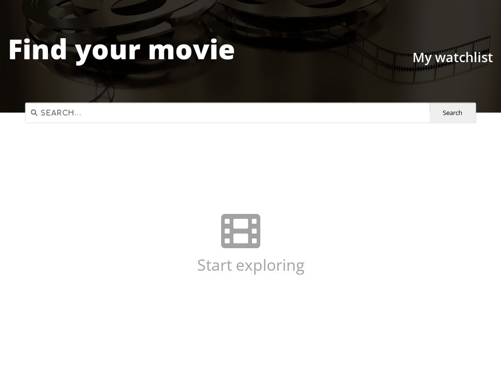

# ScrimbaSoloProject-MovieWatchlist

## Table of contents

- [Overview]
  - [The challenge requirements](#the-challenge-requirements)
  - [Screenshot](#screenshot)
  - [Links](#links)
  - [Built with](#built-with)
  - [Author](#author)

### The challenge requirements

- Two pages: index.html & watchlist.html
- Index = search page, call OMDB API and display search results
- Button 'add to watchlist' which saves data to local storage
- Watchlist loads data from local and displays it

### Screenshot

### Links

- Live Site URL: [https://ss-movie-watchlist.netlify.app/](https://your-live-site-url.com)

### Built with

- Semantic HTML5 markup
- Flexbox
- CSS Grid
- Mobile-first workflow
- Css
- Javascript

## Author

- Website - [https://abarisic-portfolio.netlify.app/index.html)]
- Frontend Mentor - [https://www.frontendmentor.io/profile/abarisic1509]
- Linkedin - [https://www.linkedin.com/in/ana-marija-bari%C5%A1i%C4%87-3b88b523a/]
